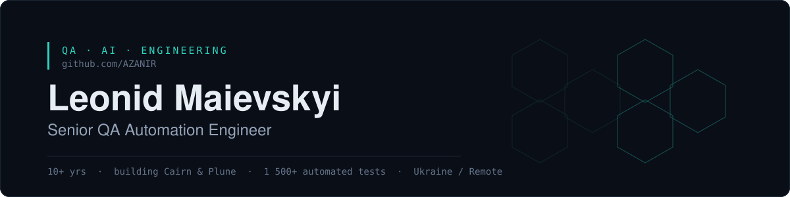

  

  <b>Senior QA Automation Engineer</b> — I build test automation that teams actually maintain, 
  and the open-source tooling they build it with.

  
  
  
  
  

  🟢 Available for work · Ukraine / Remote · 10+ yrs · 1 500+ automated tests · −80% regression time

---

## ⬡ Building

**[Cairn](https://plune.ai/cairn)** — autonomous QA agent · `Apache-2.0`
Walks your app from a saved session, grounds every locator against the live page, designs cases per ISO/IEC/IEEE 29119-4, and generates self-repairing POM-style `@playwright/test` specs. Turns an OpenAPI 3.x spec into API tests too.

**[Plune](https://plune.ai)** — eval platform for LLM apps · `MIT`
Assertion suites in one `plune.yaml` — run locally with the CLI, gate every pull request with `eval-action`, catch regressions with a diff.

## ⬡ Repositories

- [**plune-ai/cairn**](https://github.com/plune-ai/cairn) — the QA agent · `@plune-ai/cairn`
- [**plune-ai/cli**](https://github.com/plune-ai/cli) — assertion runner for `plune.yaml` · `@plune-ai/cli`
- [**mySnippetsZenno**](https://github.com/AZANIR/mySnippetsZenno) — C# snippets for ZennoPoster ⭐ 35
- [**QA_AutomationTools**](https://github.com/AZANIR/QA_AutomationTools) — tooling map for picking an automation stack
- [**Test_documentation**](https://github.com/AZANIR/Test_documentation) — test plan and bug report templates that survive real teams

## ⬡ Stack

**Automation** &nbsp;Playwright · WebdriverIO · Cypress · Robot Framework
**Languages** &nbsp;TypeScript · JavaScript · Python · SQL
**API** &nbsp;Postman · REST · GraphQL · WebSocket · Pact
**CI/CD** &nbsp;GitHub Actions · GitLab CI · Docker · AWS
**Perf & security** &nbsp;k6 · Locust · Burp Suite · OWASP ZAP
**AI** &nbsp;Claude Code · Copilot · Cursor · Langfuse

## ⬡ Writing

QA automation, AI agents, and security-minded delivery on [artstroy.net](https://artstroy.net).

<!-- BLOG-POST-LIST:START -->
- [A Local AI QA Agent: Ollama, LibreChat, and Playwright MCP](https://artstroy.net/articles/local_ai_qa_engineer_docker_ollama/) — Aug 24, 2026
- [Playwright 1.62.1 in Practice: The Changes That Matter for Automation QA](https://artstroy.net/articles/playwright_1_62_1_whats_new_automation_qa/) — Aug 3, 2026
- [How I'd Move into AI Engineering in 2026: From Automation to Reliable Systems](https://artstroy.net/articles/how_i_would_move_into_ai_engineering_in_2026/) — Jul 19, 2026
- [RAG Is No Longer Enough: How OKF Changes Agent Knowledge](https://artstroy.net/articles/okf_rag_research/) — Jul 16, 2026
- [Why Learn Programming in the Age of AI?](https://artstroy.net/articles/why_learn_programming_in_ai_era/) — Jul 13, 2026

<!-- BLOG-POST-LIST:END -->

---

  
  

   
  Open to consulting, automation builds, and team mentoring. 
  
    
  <i>quality is not an act, it's a habit</i>

